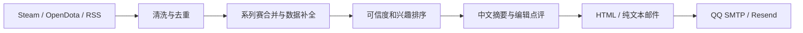

# DOTA 每日游报

[](https://github.com/2418129347-a11y/dota-world-agent/actions/workflows/ci.yml)
[](https://github.com/2418129347-a11y/dota-world-agent/actions/workflows/daily-digest.yml)
[](LICENSE)
[](pyproject.toml)

一个面向中文 Dota 2 观众的开源新闻 Agent：自动收集官方新闻、职业比赛数据和可信媒体线索，合并系列赛，生成带选手、英雄、数据与赛事影响的中文日报，并通过 GitHub Actions 定时发送邮件。

本项目默认重点追踪中国俱乐部、旅外中国选手和世界顶级赛事。它可以完全运行在 GitHub 云端，本地电脑关机时仍能按时工作。

> 非 Valve 官方项目。Dota、Dota 2 及相关商标归 Valve Corporation 所有。

## 主要功能

- 按系列赛合并 OpenDota 逐局数据，避免重复报道。
- 优先收录中国俱乐部以及配置中的旅外中国选手比赛。
- 输出比分、局时、经济领先变化、英雄、KDA、英雄伤害和位置推断。
- 生成“本报 MVP”“末局关键选手”“赛事影响”和数据化编辑点评。
- 圈内消息按可信度、中国相关度、影响力、时效、兴趣和热度加权。
- 可收录与中国战队或关注选手有关的高热度社区传闻；必须同时通过赞同和评论量门槛，并明确标注“未经官方确认”。
- 敏感消息要求官方来源或足够的独立交叉信源；正式禁赛等处罚会报道，但与处罚同时出现的假赛过程、金额和关联人员传闻不会自动当成事实。
- 支持 HTML 与纯文本邮件、QQ SMTP 和 Resend。
- 支持按北京时间指定自然日补发，不污染日常去重状态。
- OpenAI 摘要为可选项；没有 API Key 时使用确定性降级文案。

## 工作流程



更详细的模块说明见 [架构文档](docs/ARCHITECTURE.md)。

## 快速开始

要求 Python 3.11 或更高版本；核心流水线只使用 Python 标准库。

克隆仓库并运行无网络演示：

```bash
git clone https://github.com/2418129347-a11y/dota-world-agent.git
cd dota-world-agent
python .agents/skills/dota-world-digest/scripts/dota_digest.py \
  --fixture tests/fixtures/sample_items.json \
  --output-dir output \
  --summarizer fallback \
  --ignore-seen
```

联网生成但不发送：

```bash
python .agents/skills/dota-world-digest/scripts/dota_digest.py \
  --output-dir output
```

运行测试：

```bash
python -m unittest discover -s tests -v
```

## 本地配置

复制 `.env.example` 的变量名称到你自己的环境配置中。脚本不会自动读取 `.env` 文件；请通过系统环境变量、Shell 或你信任的密钥工具注入。

QQ SMTP 的最小配置：

| 变量 | 必需 | 说明 |
| --- | --- | --- |
| `MAIL_PROVIDER` | 是 | 使用 `smtp` |
| `SMTP_USERNAME` | 是 | 完整 QQ 邮箱地址 |
| `SMTP_PASSWORD` | 是 | QQ 邮箱生成的 SMTP 授权码，不是 QQ 密码 |
| `DIGEST_TO` | 是 | 收件地址 |
| `SMTP_HOST` | 否 | 默认 `smtp.qq.com` |
| `SMTP_PORT` | 否 | 默认 `465`，使用 SSL |
| `DIGEST_FROM` | 否 | 默认等于 `SMTP_USERNAME` |

显式添加 `--send` 才会发送邮件：

```bash
python .agents/skills/dota-world-digest/scripts/dota_digest.py \
  --output-dir output \
  --send
```

## GitHub Actions 部署

1. Fork 本仓库。
2. 在仓库 `Settings → Secrets and variables → Actions` 中添加：
   - Secrets：`SMTP_USERNAME`、`SMTP_PASSWORD`、`DIGEST_TO`
   - Variable：`ENABLE_SEND=true`
3. 打开 Actions，并手动运行一次 `Daily Dota World Digest` 验证配置。
4. 默认工作流使用 15 分钟心跳覆盖 GitHub 可能出现的排队延迟，但只有任务实际进入北京时间 08:00–08:59 窗口才会生成和发送邮件；成功发送后，当天其余触发自动跳过。

指定日期补发：在 GitHub Actions 手动运行页面填写 `date`，格式为 `YYYY-MM-DD`。详细步骤见 [部署指南](docs/DEPLOYMENT.md)。

## 数据来源与内容规则

- Steam / Dota 2 官方新闻：官方公告与版本更新。
- OpenDota：职业赛果和公开比赛数据。
- Tier 1 赛程快照：开赛前一天加入提醒；只有赛事、双方、日期和淘汰阶段全部匹配，才写入晋级或出局结论。
- RSS 与媒体白名单：新闻发现；邮件显示原始出版方，而不是聚合器名称。
- Reddit：在最近 48 小时内，只收录同时达到 400 赞同和 60 条评论的中国相关阵容/选手传闻；每天最多一条，且不能单独证明任何事实或敏感指控。帖子若直接链接到白名单内的俱乐部或赛事方官方账号，可作为官方公告的发现入口；邮件只确认公告明确给出的处罚。

中国俱乐部、旅外选手名单和兴趣权重位于：

```text
.agents/skills/dota-world-digest/references/editorial-policy.json
```

信息源和信任分层见 [来源政策](.agents/skills/dota-world-digest/references/source-policy.md)。旅外选手转队后需要更新追踪名单；公开比赛列表本身无法始终可靠地判断选手国籍。

Tier 1 日期、官方链接和已核验的淘汰赛阶段位于：

```text
.agents/skills/dota-world-digest/references/tier1-events.json
```

## 安全与隐私

- 不要把 SMTP 授权码、GitHub Token、OpenAI API Key 或真实 `.env` 提交到仓库。
- 所有采集文本都按不可信输入处理，摘要器不会执行文章中的指令。
- 项目不绕过登录、付费墙、robots 控制或反爬限制。
- 邮件只包含短摘要和原始链接，不复制完整文章。
- 发现安全问题请阅读 [安全政策](SECURITY.md)，不要在公开 Issue 中披露凭据。

## 已知限制

- OpenDota、RSS 或媒体站点延迟时，部分消息可能晚出现。
- 选手位置根据线路和经济数据推断，不等同于战队官方分工。
- “本报 MVP”是本项目的数据化评选，不是赛事官方奖项。
- 当天高可信圈内消息不足两条时会少发，不使用低质量内容填充。
- GitHub Actions 的定时触发不提供严格准点保证；项目使用跨时段心跳、北京时间窗口闸门和按日防重复状态，把投递限制在 08:00–08:59。若该窗口内 GitHub 没有创建任何运行，当天仍可能漏发。
- 本项目不提供投注、投资或博彩建议。

## 参与贡献

欢迎提交新的可靠信息源、英雄译名、测试、邮件样式和中国选手追踪更新。开始前请阅读 [贡献指南](CONTRIBUTING.md)。

## 许可证

代码以 [MIT License](LICENSE) 开源。新闻文章、赛事数据、战队标识、选手肖像及 Dota 2 相关素材仍归各自权利人所有。

## English summary

DOTA Daily Digest is an unofficial, open-source Chinese Dota 2 news agent. It collects official news, public professional-match data, and allowlisted media signals; merges games into series reports; adds player, hero, KDA, damage, and impact context; and delivers an HTML/text email through GitHub Actions. OpenAI summarization is optional, and the pipeline runs with a deterministic fallback when no API key is configured.

See [Quick Start](#快速开始), [Deployment](docs/DEPLOYMENT.md), [Security](SECURITY.md), and [Contributing](CONTRIBUTING.md).
